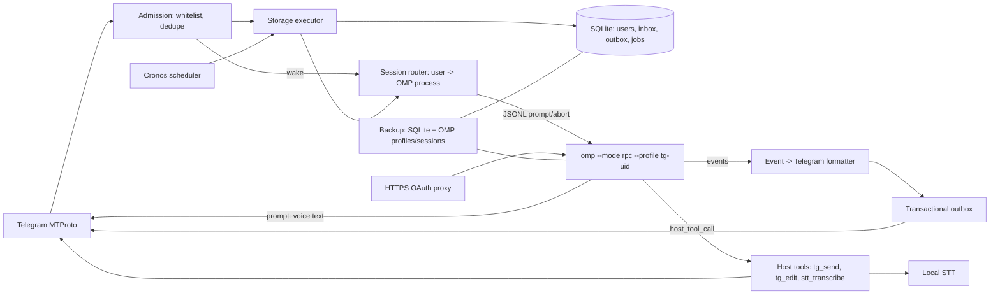

# phos — автономный AI-агент в Telegram: проверенное исследование и пофазовый план (v2 — OMP)

Дата аудита: 2026-09-13. Версии сверены с NuGet, Microsoft Learn, официальной документацией Telegram и локальной документацией OMP.
Целевое окружение: .NET 10 / F# host + OMP 18.1.19, один Linux-хост в v1.

**v2 решение: собственный агентный харнесс не пишем. «Мозг» — OMP (`omp --mode rpc`), phos — Telegram-фронтенд + host-обвязка.**

---

## 0. Итог аудита

**Решение:** OMP — это готовый Claude-Code-класс харнесс с in-process SDK (Bun/TS) и кросс-языковым RPC-режимом (JSONL over stdio). Для F#-хоста правильная граница — RPC: `omp --mode rpc`, child process на пользователя, host tools (`set_host_tools`) и host URI schemes (`set_host_uri_schemes`) как мост к Telegram. Устанавливаемый OMP 18.1.19 == npm `@oh-my-pi/pi-coding-agent@18.1.19` (проверено: registry + `omp --version`).

Что **переезжает в OMP** (не пишем сами):

| Компонент из v1 | Замена |
|---|---|
| LLM-слой: agent loop, tool calling, streaming, retry, compaction | OMP (провайдер vanbukin/DeepSeek уже настроен в `~/.omp/profiles/deepseek`) |
| MCP-клиент + OAuth (ModelContextProtocol, RFC 9728/8414/8707/9207) | OMP: `mcp.json` (stdio/http/sse), `/mcp list/add/reload/test/reauth`, хранилище кредов в `agent.db` |
| Память: SQLite FTS5 + multilingual-e5 + RRF | OMP memory backend (`mnemopi` — локальный SQLite, tools `recall`/`retain`/`reflect`/`memory_edit`; `local` — сводки) |
| Persona/skills движок | OMP: `PERSONALITY.md`, `SYSTEM.md`/`APPEND_SYSTEM.md`, `skills/`, `--profile` на пользователя |
| Per-chat coordinator, fair dispatcher, mailbox pipeline | OMP сессия (file-backed) + простой host-роутер user → RPC-процесс |
| Пишущая сторона агента (edit/write/bash) | По умолчанию **отключена** (`--tools read,grep,glob,web_search`); мутирующие тулзы — per-user opt-in |

Что **остаётся у phos** (Telegram-слой, OMP его не покрывает):

- MTProto-транспорт (WTelegramClient), whitelist/роли, rate limits, outbox с `random_id`;
- STT голосовых (OMP `app.stt` — терминальный push-to-talk, файлы не транскрибирует);
- scheduler (Cronos + durable registry);
- durable inbox/outbox + crash-семантика доставки;
- бэкапы (включая данные OMP: профили, сессии, память);
- секреты (bot token, API key провайдера), F# quality gates.

**Зафиксированный scope:** личный проект с доверенным провайдером и конфигурируемым whitelist. In-app consent/privacy flow не реализуется.

Технические исправления, оставшиеся актуальными из v1:

1. Bounded `Channel.WriteAsync` при заполнении ждёт место — не использовать как единственный канал; durable SQLite остаётся source of truth.
2. `Microsoft.Data.Sqlite` не имеет настоящего async I/O — один dedicated storage executor.
3. NCrontab не решает timezone/DST — выбран Cronos.
4. Официальный Orleans ADO.NET provider не поддерживает SQLite — Orleans не нужен (OMP уже держит сессии).
5. Для F# выбран Fantomas + coverage/mutation gate.

Снятые пункты v1 (переехали в OMP, больше не исследуем): BM25/RRF/embedding-паритет, MCP OAuth RFC-разбор и SSRF-защита клиента, OpenAI-compat spike, sqlite-vec, консолидация памяти.

---

## 1. Выбранный стек

| Слой | Решение | Проверенный пакет/версия | Статус |
|---|---|---|---|
| Host runtime | F# на .NET 10, Generic Host | SDK фиксируется `global.json` | [OK] |
| Telegram | Прямой MTProto bot login | WTelegramClient 4.4.8, MIT | [OK] |
| Агент | OMP 18.1.19, `--mode rpc`, per-user `--profile` | `omp` (установлен; npm `@oh-my-pi/pi-coding-agent@18.1.19`) | [SPIKE] F# RPC-клиент |
| LLM | Провайдер vanbukin (openai-completions, tools, 500k ctx) | `models.yml` + `.env` в OMP-профиле | [OK] — конфиг переносится |
| MCP | OMP встроенный (stdio/http/sse, OAuth) | — | [OK] + phos HTTPS-прокси OAuth-колбэка |
| Память | OMP `memory.backend: mnemopi` | локальный SQLite, per agent dir | [OK] |
| Голос | GigaAM v3 CTC int8 + Whisper fallback | sherpa-onnx 1.13.8; Whisper.net 1.9.1 | [SPIKE] benchmark |
| Admission/queue | SQLite `command_inbox`/`message_outbox` (упрощённый) | Microsoft.Data.Sqlite 10.x | [OK] |
| Расписание | Cronos + собственный durable registry | Cronos 0.13.0, MIT | [OK] |
| Бэкапы | `VACUUM INTO` + age + снапшот OMP-данных | SQLite + age | [OK] |

`WTelegramBot` не используется — это Bot-API-shaped слой поверх WTelegramClient; ходим по MTProto напрямую.

---

## 2. Глубокий разбор

### 2.1. Telegram: MTProto bot login, команды, голос, whitelist

#### Аутентификация

WTelegramClient авторизует BotFather-бота напрямую в Telegram DC:

1. config callback отдаёт `api_id`, `api_hash`, `bot_token`, `session_pathname`;
2. `LoginBotIfNeeded()` вызывает `Auth_ImportBotAuthorization`;
3. после login подписываемся на `OnUpdates`/`UpdateManager`;
4. работаем только с MTProto-методами, отмеченными `Both users and bots...`/`bots: ✓`.

```fsharp
let wtConfig =
    Func<string, string>(fun key ->
        match key with
        | "api_id" -> settings.ApiId.ToString()
        | "api_hash" -> settings.ApiHash
        | "bot_token" -> settings.BotToken
        | "session_pathname" -> settings.SessionPath
        | _ -> null)

use client = new WTelegram.Client(wtConfig)
let! bot = client.LoginBotIfNeeded()
```

`messages.sendMessage` и `upload.getFile` доступны ботам; `messages.transcribeAudio` — только пользователям и не используется (STT у нас локальный, §2.1.1).

#### Секреты и сессия

- Production: systemd credentials/отдельный secret store; environment variables допустимы только для локальной разработки.
- Имена: `PHOS_TELEGRAM_API_ID`, `PHOS_TELEGRAM_API_HASH`, `PHOS_TELEGRAM_BOT_TOKEN`; ключ провайдера LLM — в OMP-профиле (переносится из `~/.omp/profiles/deepseek/.env`).
- Значения не пишутся в YAML, SQLite, логи, crash dump или backup.
- WTelegram session по умолчанию шифруется `api_hash`/`session_key`; файл `data/wtelegram-bot.session`, mode `0600`, каталог `0700`.
- Потеря `api_hash` означает потерю возможности прочитать session file; источник секрета должен иметь отдельный backup/rotation plan.

#### Whitelist и границы v1

- Whitelist хранит immutable numeric Telegram user IDs, не usernames.
- Роли: `owner`, `admin`, `user`; административные инструменты доступны только owner/admin.
- По умолчанию разрешены только private chats; группы/каналы включаются только явными chat IDs в whitelist.
- Бот не начинает ЛС: пользователь должен открыть t.me-ссылку или отправить `/start`.

#### Отправка, rate limits, idempotency

- Текст режется по 4096 UTF-16 code units с учётом entities и code fences.
- Entity bounds считаются в UTF-16; при ошибке форматирования — один fallback в plain text.
- Для live drafts Telegram документирует per-peer лимиты `20/5s` и `40/30s`; основная истина для остальных операций — `FLOOD_WAIT_%d`/`SLOWMODE_WAIT_%d`.
- Каждый outbound сначала пишется в `message_outbox` с устойчивым MTProto `random_id`. Retry повторяет тот же `random_id`, а не создаёт новое сообщение.
- Telegram-side scheduling для бота запрещён (`SCHEDULE_BOT_NOT_ALLOWED`); scheduler отправляет обычное сообщение в момент запуска.
- File references могут истекать; `FILE_REFERENCE_EXPIRED` требует refetch сообщения/документа.

### 2.1.1. Локальная STT на CPU

OMP `app.stt`/`/live` — это терминальный push-to-talk микрофон; **файлы не транскрибирует**. Голосовые из Telegram (OGG/Opus) обрабатывает phos.

#### Проверенные факты

- sherpa-onnx 1.13.8 имеет .NET package и linux-x64 CPU runtime.
- Документированный официальный пакет GigaAM v2 CTC int8: 226 МБ, RTF 0.329 на опубликованном примере при 2 threads.
- GigaAM v3 CTC int8 (~225 МБ) существует на HF и работает с sherpa-onnx; issue #3619 закрыт после корректной конфигурации. Но v3 всё ещё не включён в основную страницу release models — нужен startup self-test и pin checksum.
- GigaAM v3 benchmark: средний WER 9.1% (CTC) и 8.3% (RNNT) на десяти русских наборах; CV19 1.3%/0.9% против Whisper 5.5% — это dataset-specific цифры, не универсальная точность.
- Текущий GigaAM repository — MIT; старый v1 model package был non-commercial. v2/v3 нельзя помечать NC без проверки конкретного checkpoint LICENSE.

#### Pipeline

`OGG/Opus` → `ffmpeg` subprocess (argv без shell, timeout, max bytes/duration) → mono PCM16 WAV → Silero VAD → GigaAM v3 CTC → optional Whisper medium/small q5_0.

- `ffmpeg` — явная operational dependency; входной filename не интерполируется в shell.
- Limits до decode: размер, длительность, codec/container, disk quota.
- STT имеет отдельный `SemaphoreSlim(maxConcurrentStt)`, default 1 на CPU-only host.
- Автоматический fallback по «низкому confidence» не включаем до калибровки: CTC score не является готовой probability. В первой версии fallback выбирается командой/языковой эвристикой; затем — по benchmark на реальных RU/RU-EN voice messages.
- Точная производительность v3/Whisper — не факт из чужого CPU. Phase 0 spike измеряет p50/p95 RTF и peak RSS на target host для threads 1/2/4/8/16.
- Golden STT-тест сравнивает WER/CER threshold, а не точную строку: апгрейд runtime может легитимно менять punctuation/spacing.

Primary: GigaAM v3 CTC int8. Fallback checkpoint: документированный v2 CTC. RNNT не входит в CPU-v1 до собственного benchmark.

### 2.2. OMP как агентный движок

#### Почему RPC, а не in-process SDK

SDK `@oh-my-pi/pi-coding-agent` (`createAgentSession()` → `session.prompt()` → `session.subscribe()` → `dispose()`) — Bun/TS-only (engines: `bun >=1.3.14`), встраивается только в Bun-процесс. Host у нас F# → граница = **RPC-режим** (`omp --mode rpc`): newline-delimited JSON по stdio, документированный провод, готовые клиенты TS и Python, .NET-клиента нет — пишем свой (простые JSONL, ~300–500 строк) либо sidecar.

#### Интеграционная поверхность (проверено по `omp://rpc.md`)

- Старт: `ready`-фрейм (`protocolVersion`, `maxFrameBytes`); опционально `negotiate_protocol` v2 (фрагментация больших объектов).
- Команды (stdin): `prompt`, `steer`, `follow_up`, `abort`, `abort_and_prompt`, `new_session`, `get_state`, `set_model`, `cycle_model`, `get_available_models`, `set_thinking_level`, `compact`, `set_auto_compaction`, `set_auto_retry`, `bash`, `get_messages`/`get_messages_page`, `get_last_assistant_text`, `switch_session`, `set_todos`, `set_host_tools`, `set_host_uri_schemes`, `set_subagent_subscription`, `get_subagents`.
- События (stdout): `agent_start`, `agent_end` (с `isTerminal`), `message_update` (text/thinking/toolcall-дельты), `tool_execution_start/update/end`, `auto_compaction_*`, `auto_retry_*`, `model_changed`, `thinking_level_changed`, `todo_reminder`, `notice`, `irc_message`.
- **Host tools**: `set_host_tools` (JSON-схемы) → агент шлёт `host_tool_call` → phos исполняет → `host_tool_update`/`host_tool_result` (с `isError`). Мост к Telegram: `tg_send_message`, `tg_edit_message`, `tg_voice_transcribe` (STT), `tg_get_file`, `schedule_add` и т.д.
- **Host URI schemes**: `set_host_uri_schemes` → чтение/запись `<scheme>://...` прокидывается хосту (виртуальные файлы `tg://...`). `edit`-tool host URI не трогает — только `write`.

#### Ключевая семантика

- `prompt`/`abort_and_prompt` **акаются сразу**; завершение хода = `agent_end` с `isTerminal !== false`. Для local-only команд (slash commands) — `data.agentInvoked: false` или `prompt_result`. Host обязан ждать события, а не ответ на команду.
- Во время стрима `prompt` требует `streamingBehavior: "steer" | "followUp"`; дефолты: `steeringMode: one-at-a-time`, `interruptMode: immediate`.
- Слэш-команды работают через `prompt` (`get_available_commands`); `/stop` → `abort`.
- Собственный `RpcSessionState` не отдаёт `autoRetryEnabled` — host сам трекает.

#### Запуск процесса (проверено по `omp://cli-reference.md`)

```bash
omp --mode rpc \
    --profile tg-<user_id> \        # изолированный профиль: auth, sessions, settings, caches
    --session-dir ~/.phos/sessions/<user_id> \
    --tools read,grep,glob,web_search \  # allowlist; мутирующие тулзы по умолчанию выключены
    --approval-mode yolo            # или always-ask/write; policy решает host
    --max-time 1h                   # сторожевой таймер
```

- `--resume <id|path>` / `--continue` — восстановить сессию пользователя после рестарта.
- `--no-session` — эфемерная сессия (не для v1; персистентность нужна).
- `--config <file>` — оверлей конфига; `--no-lsp` — LSP в v1 не нужен.

#### Per-user архитектура

- **Профиль на пользователя**: `omp --profile tg-<uid>` → `~/.omp/profiles/tg-<uid>/agent/` (свои `models.yml`, `.env`, `PERSONALITY.md`, `SYSTEM.md`, `skills/`, `mcp.json`, память, сессии). Провижининг: шаблон `~/.omp/profiles/phos-template/` копируется при первом контакте пользователя; API-key провайдера — общий, из systemd credential в `.env` шаблона.
- **Рабочая директория на пользователя**: `~/.phos/workspace/<uid>/` (cwd OMP-процесса) — проектный `mcp.json`, контекст-файлы, AGENTS.md per-user.
- **Idle-политика**: процесс живёт, пока есть активный turn; по таймауту (настраиваемый, например 30 мин) — SIGTERM, при следующем сообщении — respawn с `--resume`.
- Альтернатива «один процесс на всех» отклонена: persona/skills/память/MCP живут в профиле, а не в сессии — общий процесс не даёт изоляции.

**Phase 0 spike подтверждает**: провижининг профиля из шаблона, `--resume` в RPC, `set_host_tools` roundtrip, событие `agent_end` с `isTerminal`, `/stop`.

### 2.3. Персональность и skills — OMP

Три слоя v1 (persona → skills → per-user выбор) реализуются штатными механизмами OMP:

- `PERSONALITY.md` в agent dir профиля — заменяет выбранный preset `personality` (default/friendly/pragmatic/none). Один файл = одна «персональность»; смена persona = запись файла + `new_session` (или respawn профиля).
- `SYSTEM.md` / `APPEND_SYSTEM.md` — проект-первый, потом user (`<cwd>/.omp/`, `~/.omp/profiles/<name>/agent/`). `SYSTEM.md` заменяет дефолтный шаблон инструкций, но сохраняет context files/skills/rules; `APPEND_SYSTEM.md` — добавить к дефолтному.
- `skills/` — `<root>/<skill>/SKILL.md` (нерекурсивно), metadata в system prompt + содержимое через `read skill://...`, `/skill:<name>`. Провайдеры: native `.omp`, managed (autolearn), claude/codex/agents и др.
- Установка/изменение — только owner/admin, через phos (host пишет файлы профиля) или через OMP-сессию с разрешённым `write` (по policy). Навыки из сети не устанавливаются самим LLM без review — host-политика, не доверяем агенту.

### 2.4. Память и state — OMP

- Бэкенд: `memory.backend: mnemopi` — локальный SQLite per agent dir, tools `recall`/`retain`/`reflect`/`memory_edit` (рабочая + эпизодическая память, авто-запоминание завершённых ходов, `memory://<id>` полные строки). Альтернатива `local` — сводки/уроки из сессий (`MEMORY.md`, `learned.md`, `skills/`).
- Изоляция: per-user профиль → per-user память автоматически. Общая память между профилями — только через явный обмен файлами (не в v1).
- Conversation history отделена от long-term memory (сообщение не становится фактом автоматически) — модель OMP.
- «Запоминать и вспоминать» = `learn`/`retain`/`recall`/`reflect` в харнессе; host не пишет свою память. Данные бэкапятся с профилем.

### 2.5. MCP: конфиг и OAuth — OMP + phos-прокси

- Конфиг: user-scope per profile — `~/.omp/profiles/<name>/agent/mcp.json` (OMP-owned); project-scope — `.omp/mcp.json` в cwd (per-user workspace). Транспорты: `stdio` (default), `http` (Streamable HTTP), `sse` (legacy).
- Управление: `/mcp add` (wizard), `/mcp list`, `/mcp enable/disable`, `/mcp reload`, `/mcp test`, `/mcp reconnect`, `/mcp reauth`, `/mcp unauth`. В RPC всё это — через `prompt` (slash commands), либо phos пишет JSON напрямую и шлёт `/mcp reload`.
- **«Бот сам подключает MCP»**: агент может предложить сервер; исполняет только owner/admin. Phos (или разрешённая сессия) пишет `mcp.json` → `/mcp reload`. `disabledServers` — верхнеприоритетный denylist.
- **OAuth**: OMP сам — authorization code + PKCE, хранит refresh-материал в `agent.db` профиля (`mcp_oauth:profile:<profile>:<url>`), колбэк-слушатель на loopback (`callbackPort`/`callbackPath`; default порт 3000). Проблема: пользователь в Telegram не имеет доступа к loopback хоста → **phos поднимает публичный HTTPS-endpoint (одноразовый, короткий TTL, state-bound), который проксирует на OMP loopback-слушатель**; `oauth.redirectUri` = публичный URL. Полный redirect URL с code не пересылается через Telegram (paste-flow — только dev fallback с немедленной redaction).
- **SSRF на прокси**: HTTPS-only (кроме loopback dev), reject loopback/private/link-local/cloud-metadata, DNS-resolve + connect-time validation, лимиты редиректов/размера/времени, exact redirect URI + state/issuer.
- **Security stdio**: `mcp.json` = arbitrary command execution → только доверенные конфиги, профильная изоляция, review чужого `mcp.json` перед запуском профиля с кредами; `${VAR}`/`!command` резолв — знать и валидировать.

### 2.6. Задачи по расписанию

Выбор: **Cronos 0.13.0 + собственный durable registry** (без изменений из v1).

- `schedule_jobs`: cron, IANA timezone, prompt, enabled, catch-up policy, next_run.
- `schedule_runs(job_id, scheduled_for)` с UNIQUE — дедупликация конкретного occurrence.
- Scheduler транзакционно claims due run, затем кладёт обычную команду `origin=schedule` в `command_inbox` → доставка в OMP-сессию пользователя как `prompt` (или host tool `schedule_run`).
- Default misfire: skip missed runs; максимум один catch-up только при явном выборе.
- `schedule_add` всегда показывает следующие 5 UTC+local timestamps и требует confirm.
- Минимальный интервал, per-user quota, запрет саморепликации расписаний без нового явного подтверждения.

### 2.7. Storage, encryption и backups

#### SQLite execution model

SQLite поддерживает concurrency, но только одного writer. `Microsoft.Data.Sqlite` async методы выполняются синхронно.

- Один dedicated storage executor/thread владеет write connections и возвращает `Task`/`Async` callers через reply/TCS.
- Reads используют небольшой bounded pool отдельных connections; объекты connection/command/reader между threads не разделяются.
- WAL, `busy_timeout`, короткие transactions, foreign keys, controlled checkpoints.
- Долгие FTS/reindex/backup не выполняются в Telegram callback.

#### Что хранит phos (урезано из v1 — память/MCP/персоны переехали в OMP)

`users`, `command_inbox`, `message_outbox`, `schedule_jobs`, `schedule_runs`, `backup_log`. Вся история разговоров и память — в OMP (session-файлы + `agent.db`).

#### Backup

- Нельзя копировать только `.db` при WAL.
- `VACUUM INTO` создаёт consistent compact snapshot; destination должен быть absent/empty; при interruption output может быть corrupt; нужен свободный disk budget до ~2× DB.
- Снапшот = SQLite-дамп + **снапшот OMP-данных** (`~/.omp/profiles/tg-*`, `~/.phos/workspace/*`, session-dir). OMP-сессии — JSONL; атомарный copy (наприм. rsync/tar с fsync) с проверкой целостности.
- Snapshot → manifest (app/schema/model versions + checksums) → `age` recipient encryption → atomic publish → off-host copy → daily/weekly/monthly retention.
- Не используем unattended `age -p`; recipient key хранится отдельно.
- Bot token, API-key провайдера, WTelegram session — только в отдельный secret-backup process.
- Restore: stop → decrypt → checksum → replace DB и OMP-профили → `integrity_check` + schema check → start.
- Restore drill автоматический на disposable copy еженедельно и ручной off-host drill ежеквартально.

### 2.8. F# quality gate и TDD

- SDK pin: `global.json`; F# nullable analysis: `<Nullable>enable</Nullable>` (F# 9+ → `--checknulls+`).
- `<TreatWarningsAsErrors>true</TreatWarningsAsErrors>`; без дублирующего `OtherFlags --warnaserror+`.
- `#nowarn`/warning suppression — только минимальный scope + комментарий.
- Local tools manifest: Fantomas (`dotnet fantomas . --check`) + `dotnet-fsharplint` (`dotnet fsharplint lint Phos.sln`).
- `dotnet format` не считается F# formatter; допускается отдельно для Roslyn analyzers/C# interop.
- Tests: xUnit v2 + FsUnit + FsCheck.Xunit. Один coverage integration: Coverlet MSBuild в VSTest mode; не смешивать с MTP v2.
- Blocking CI: line >= 90%, branch >= 85% total; Core/Storage/Scheduler branch >= 90%; исключается только generated/interoperability code с review.
- Nightly Stryker.NET по Core/Storage/Scheduler: сначала report, затем break threshold 70%.
- Каждый механизм: failing test → implementation → green. Каждый баг: воспроизводящий regression test до fix.
- Реальные Telegram/MCP/STT tests имеют integration category и идут nightly/manual; fast CI использует fake transport/server, но проверяет observable contract, не wiring. OMP-интеграционные тесты — против локального `omp --mode rpc` (fake LLM через локальный endpoint) в CI, помечены integration.

### 2.9. Async-first pipeline: упрощённый дизайн

Харнесс v1 (fair dispatcher, per-chat coordinator, resource semaphores, mailbox state machine) **не нужен**: один turn на сессию держит сам OMP; у нас — host-роутер user → процесс + примитивная очередь на chat.

#### Admission и durable queue

`command_inbox` в SQLite — source of truth для команд пользователя и scheduled jobs:

1. Telegram handler валидирует whitelist и классифицирует control command (`/stop`, `/schedule_add`, ...).
2. Через storage executor — короткая транзакция dedupe + INSERT `pending`.
3. Роутер пробуждается (coalescing wake-channel; его переполнение не критично — периодический скан `pending`).
4. Роутер: пользователь без процесса → spawn `omp --mode rpc --profile tg-<uid> --resume ...`; команда → `prompt` (или `abort` для `/stop`; `streamingBehavior: "followUp"` если turn идёт).

Admission имеет короткий configurable DB timeout (2 s). Если durable commit не состоялся, команда **не считается принятой**: best-effort «хранилище занято, повторите», alert, метрика.

#### Взаимодействие с OMP-процессом

- События `message_update` (text_delta) → форматтер → outbox → Telegram (первые N chars — «печатает...», потом чанки по 4096).
- `tool_execution_start` (host tools) → статус-сообщение, если tool долгий.
- `agent_end` (`isTerminal !== false`) → финальный текст + отметка команды `done`.
- `abort` → `/stop` (немедленный; не ждёт очередь).
- Процесс умер (крэш/OOM/таймаут) → respawn c `--resume`; команда остаётся `pending` с lease → retry (max attempts + dead-letter).
- При смерти хоста: OMP-процессы — дети, умирают вместе; при старте respawn и `--resume`; in-flight команды — `needs_review` (не автоповтор: ход мог частично выполниться).

#### Delivery и crash semantics

- Command execution: at-least-once (inbox lease + retry).
- Outbound delivery: transactional outbox + стабильный MTProto `random_id` (без изменений из v1).
- Host tool side effects: не exactly-once. `tool_call_id` + idempotency key + result; unknown state → `needs_review`.
- Graceful shutdown: stop admission → `abort` активных OMP-ходов → flush outbox → release leases → SIGTERM процессам.

#### Обязательные concurrency tests (адаптированы)

- handler принимает второй chat, пока первый OMP-turn идёт;
- `/stop` отменяет текущий ход до его завершения (событие `agent_end` без терминала / abort-подтверждение);
- заполненный wake-channel не теряет durable command;
- crash после inbox commit, после claim, после host tool side effect и после Telegram send;
- retry сохраняет outbound `random_id` и не создаёт второй message;
- OMP-процесс умер → respawn + resume, команда не потеряна и не дублирована;
- queue quotas и dead-letter;
- SQLite busy/locked не блокирует Telegram reactor сверх admission timeout.

---

## 3. Архитектура



**Проекты:**

```text
Phos.sln
├─ src/Phos.Core
├─ src/Phos.Storage
├─ src/Phos.Telegram
├─ src/Phos.Speech
├─ src/Phos.Omp          # RPC-клиент, session manager, host tools, профили
├─ src/Phos.Scheduler
├─ src/Phos.Backup
└─ src/Phos.App
tests/
├─ Phos.Tests
└─ Phos.IntegrationTests
```

**Ключевая схема данных:**

```sql
users(user_id PK, username, role, omp_profile, timezone, created_at, updated_at);
command_inbox(id PK, origin, external_key UNIQUE, user_id, chat_id, payload,
              priority, status, lease_until, heartbeat_at, attempts, created_at, updated_at);
message_outbox(id PK, command_id, chunk_index, chat_id, random_id UNIQUE, payload,
               status, remote_message_id, attempts, created_at, updated_at,
               UNIQUE(command_id,chunk_index));
schedule_jobs(id PK, user_id, cron_expr, timezone, prompt, enabled,
              catchup_policy, next_run, created_at, updated_at);
schedule_runs(job_id, scheduled_for, status, command_id,
              PRIMARY KEY(job_id,scheduled_for));
backup_log(id PK, started_at, finished_at, path, checksum, status, error);
```

Удалено из v1: `personas`, `state`, `conversation_messages`, `memories`, `mcp_servers`, `mcp_tokens`, `oauth_pending` — всё это живёт в OMP (профили, session-файлы, `agent.db`).

---

## 4. Пофазовый план (TDD)

### Phase 0 — Gates и технические spikes

- Pin SDK/packages; WarningAsErrors, nullable, Fantomas, FSharpLint, coverage gates.
- Throwaway spikes:
  - **OMP RPC клиент**: spawn `omp --mode rpc` (профиль phos-spike из шаблона), `prompt` → `agent_end` (`isTerminal`), `set_host_tools` roundtrip, `abort`, `--resume`, `/stop`; замер старта процесса и p95 первого токена;
  - **профиль-провижининг**: копия шаблона (`models.yml`, `.env`, `PERSONALITY.md`) → `omp --profile` работает с изолированными кредами/сессиями/памятью;
  - GigaAM v3 CTC через sherpa-onnx + CPU benchmark (наследуется из v1 spike-03).
- **Acceptance:** все spikes имеют записанный фактический вывод; любой failed blocker меняет выбор технологии до production code.

### Phase 1 — Domain policies

- Domain types; whitelist/tool policies; UTF-16 chunker; schedule occurrence policy; inbox/outbox state machines.
- FsCheck: chunk invariants, state transitions, cron/DST fixtures, whitelist/tool authorization.
- **Acceptance:** Core без I/O и branch coverage >=90%.

### Phase 2 — Encrypted storage и durable queue

- Migrations; storage executor; WAL/checkpoint policy; inbox/outbox leases; repositories.
- Tests на temp-file SQLite с WAL: concurrency, busy timeout, crash boundaries, migrations, restart replay.
- **Acceptance:** durable command переживает process kill; keys отсутствуют в DB/логах.

### Phase 3 — Telegram transport

- Bot login, UpdateManager, peer cache/access hashes, voice download, entity-safe send/edit/live draft, FLOOD_WAIT, random-id outbox delivery.
- Whitelist проверяется до queue admission.
- **Acceptance:** allowlisted user `/start` → `/ping`; duplicate update обрабатывается один раз; voice bytes скачаны; phone/code/2FA не запрашиваются.

### Phase 4 — Speech

- Safe ffmpeg decode, VAD, GigaAM primary, Whisper explicit fallback, limits and STT semaphore.
- Tests: malformed/oversized/timeout audio; WER thresholds; runtime/model checksum.
- **Acceptance:** real RU and RU/EN fixtures; p50/p95 RTF/RSS recorded on target CPU; selected defaults follow measured data.

### Phase 5 — OMP session manager

- F# RPC-клиент (JSONL, v2 chunking, id-корреляция); profile provisioning; spawn/respawn/`--resume`; idle-таймаут; роутер user → процесс; `prompt`/`abort`/`followUp`; event → outbox-форматтер; host tools (`tg_send_message`, `tg_edit_message`, `stt_transcribe`); host URI (`tg://`); `/stop`.
- Интеграционные тесты против реального `omp` с fake LLM endpoint; контрактные тесты на wire-протокол.
- **Acceptance:** два пользователя → два изолированных профиля/сессии; `agent_end` дожидается `isTerminal`; `/stop` прерывает ход; убийство процесса → respawn + resume без потери и без дубля; переполнение очереди не теряет команду.

### Phase 6 — Scheduler

- Cronos registry; occurrence uniqueness; claim/lease; skip/catch-up; enqueue via command inbox.
- **Acceptance:** DST spring/fall fixtures, restart, duplicate tick, quota and confirmation; one scheduled occurrence produces one command.

### Phase 7 — Backups

- SQLite snapshot + OMP-профили/сессии; manifest/checksums; age recipient encryption; off-host copy; retention; automated restore.
- **Acceptance:** disposable restore возвращает `integrity_check: ok`, корректные схему и данные; восстанавливаются OMP-профили (модель, память, сессии); corrupt/truncated backup rejected.

### Phase 8 — Hardening и load

- systemd sandbox, resource limits, secret redaction, metrics/alerts, queue quotas, OMP version pin + update-runbook (контрактные тесты против нового RPC-протокола), incident/runbooks.
- 30-minute load: несколько пользователей, concurrent STT/MCP, scheduler, backup, restart; OAuth-прокси под нагрузкой.
- **Acceptance:** no lost admitted commands; no cross-user leakage; bounded RSS/queues; recovery states explainable.

**Зависимости:** `0 → 1 → 2 → 3`; после 3 параллельны 4 и 5; scheduler (6) требует 5; backups (7) требуют 2; hardening (8) — финальная интеграция. ОAuth-прокси (часть §2.5) входит в Phase 5.

---

## 5. Главные риски и слабые места

| Риск | Severity | Митигация / решение |
|---|---|---|
| OMP — большой сторонний харнесс; RPC-протокол/поведение меняется между версиями | high | pin 18.1.19; контрактные тесты на wire-формат; update-runbook с прогоном integration suite; никакого auto-update |
| MCP stdio = arbitrary code execution | critical | только доверенные `mcp.json`; профильная изоляция; review чужих конфигов; `disabledServers`; host-политика на подключение |
| Prompt injection из MCP/files/web | critical | untrusted-content граница OMP; `--approval-mode` для мутаций; мутирующие тулзы по умолчанию выключены; host-enforced policy |
| OAuth-прокси: SSRF/DNS rebinding/утечка кода | high | HTTPS-only, address/redirect validation, короткий state, single-use, no production paste-flow |
| Per-user процессы: N × (bun + OMP) память/CPU | high | idle-timeout + respawn `--resume`; cap активных пользователей; метрики; при необходимости один процесс на группу с раздельной памятью — только после измерений |
| Сессия OMP: после крэша хода состояние unknown | high | inbox lease + `needs_review` (не автоповтор); `agent_end` с `isTerminal` как единственный сигнал завершения |
| SQLite synchronous I/O/single writer | high | dedicated executor, короткие транзакции, WAL, bounded admission timeout, метрики |
| Не существует exactly-once для внешних side effects | high | outbox/idempotency; unknown → needs_review |
| Утечка bot token/API-key провайдера/session | high | systemd credentials/secret store, 0600, rotation, redaction; ключ провайдера — в OMP-профиле (в бэкап не входит) |
| Backup существует, restore не работает | high | checksums, automated restore drill (включая OMP-профили), off-host copies |
| OMP STT не покрывает голосовые файлы | medium | остаётся собственный STT (GigaAM/Whisper); WER/RTF на target CPU |
| STT цифры не переносятся на target CPU/voice domain | medium | собственные p50/p95 RTF/RSS/WER; no estimated SLA |
| WTelegramClient single maintainer | medium | pin version, interface boundary, protocol smoke on upgrade |
| «Агент сам подключает MCP» упирается в wizard/интерактив | medium | host пишет `mcp.json` напрямую + `/mcp reload`; wizard — только для ручного использования |
| Модель «500k» создаёт latency/cost illusion | medium | measured provider cap, token бюджеты, compaction OMP; конфиг-метаданные не SLA |

---

## 6. Проверенные источники

- **OMP 18.1.19**: `omp --version`; npm registry `@oh-my-pi/pi-coding-agent@18.1.19` (bin `omp`, engines `bun >=1.3.14`); локальные `omp://` docs: `sdk.md`, `rpc.md`, `cli-reference.md`, `mcp-config.md`, `memory.md`, `mnemosyne-memory-backend.md`, `skills.md`, `system-prompt-customization.md`, `session-operations-export-share-fork-resume.md`, `compaction.md`, `non-compaction-retry-policy.md`.
- Telegram MTProto bots/auth/methods: `core.telegram.org/api/bots`, `core.telegram.org/method/auth.importBotAuthorization`, `core.telegram.org/method/messages.sendMessage`, `core.telegram.org/method/upload.getFile`, `core.telegram.org/method/messages.transcribeAudio`, `core.telegram.org/api/bots/ai`.
- WTelegramClient 4.4.8: NuGet; `github.com/wiz0u/WTelegramClient` README/FAQ/EXAMPLES and `src/Client.cs::LoginBotIfNeeded`.
- Async/.NET: Microsoft Learn `System.Threading.Channels`, `Microsoft.Data.Sqlite async limitations`; Orleans 10.3.1 NuGet (не используется).
- Scheduler: Cronos 0.13.0 README/NuGet (timezone/DST); NCrontab 3.4.0 reviewed and rejected.
- Backup/encryption: SQLite `VACUUM INTO`; Microsoft.Data.Sqlite online backup/encryption/custom SQLite docs; age.
- F#: Microsoft Learn F# nullable/compiler/formatting docs; Fantomas; FSharpLint; Coverlet threshold docs; Stryker.NET.
- STT: GigaAM README/evaluation/LICENSE; sherpa-onnx GigaAM docs and issue #3619; sherpa-onnx 1.13.8; Whisper.net 1.9.1.

---

## 7. Что не меняется от v1 (история)

v1-plan (2026-09-12) с собственным харнессом — заменён этим документом. Существующие артефакты:
- `docs/phase0-summary.md` — историческая сводка v1 Phase 0 (gates + spikes LLM/embedding/STT); актуальны только gates и spike-03 (STT).
- `spikes/spike-01-openai/`, `spikes/spike-02-embeddings/` — устарели (LLM/память — OMP), остаются как история.
- `spikes/spike-03-stt/` — актуален, наследуется в Phase 0/4.
