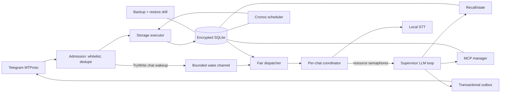

# phos — автономный AI-агент в Telegram: проверенное исследование и пофазовый план

Дата аудита: 2026-09-12. Версии сверены с NuGet, Microsoft Learn и официальной документацией Telegram/MCP/.NET.
Целевое окружение: .NET 10 / F#, один Linux-хост в v1.

---

## 0. Итог аудита

**Проект реализуем на F#.** Переход на Bun/TypeScript не нужен: используемые C#/.NET-библиотеки доступны из F#.

Технические ошибки исходного плана исправлены:

1. Bounded `Channel.WriteAsync` при заполнении ждёт место и логически останавливает producer.
2. Перекладывание из bounded channel в неограниченные `MailboxProcessor` уничтожает ограничение памяти.
3. `MailboxProcessor`, ожидающий LLM внутри обработчика, не может вовремя принять `/stop`.
4. `Microsoft.Data.Sqlite` не имеет настоящего async I/O.
5. `alpha*cos + (1-alpha)*bm25` некорректен: SQLite BM25 имеет другой масштаб и направление.
6. Exact cosine по 100k × 384 float не гарантирует `<1 ms`.
7. NCrontab не решает timezone/DST; выбран Cronos.
8. Официальный Orleans ADO.NET provider не поддерживает SQLite.
9. MCP OAuth исправлен на RFC 9728/8414/8707/9207; DCR обозначен legacy.
10. Для F# выбран Fantomas и добавлен coverage/mutation gate.

**Зафиксированный scope:** это личный проект с доверенным провайдером и конфигурируемым whitelist. In-app consent/privacy flow не реализуется. OMP прорабатывается отдельным треком и в этот план не входит.

---
## 1. Выбранный стек

| Слой | Решение | Проверенный пакет/версия | Статус |
|---|---|---|---|
| Runtime | F# на .NET 10, Generic Host | SDK фиксируется `global.json` | [OK] |
| Telegram | Прямой MTProto bot login | WTelegramClient 4.4.8, MIT | [OK] |
| Admission/queue | SQLite `command_inbox` как source of truth + coalescing wake-channel | Microsoft.Data.Sqlite 10.x + `System.Threading.Channels` | [OK], дизайн ниже |
| Per-chat coordinator | F# `MailboxProcessor`, но без work backlog внутри | FSharp.Core | [OK] |
| LLM | OpenAI-compatible endpoint | Microsoft.Extensions.AI/OpenAI 10.10.0 + OpenAI 2.13.0 | [SPIKE] tool-calling compatibility |
| Голос | GigaAM v3 CTC int8 + Whisper fallback | sherpa-onnx 1.13.8; Whisper.net 1.9.1 | [SPIKE] benchmark на target CPU |
| MCP | stdio + Streamable HTTP; legacy SSE compatibility only | ModelContextProtocol 2.2.0, Apache-2.0 | [OK] |
| Память | SQLite FTS5 + multilingual-e5-small ONNX + exact/vector gate | ONNX Runtime 1.30.0; sqlite-vec 0.1.9 optional | [SPIKE] tokenizer parity/performance |
| Расписание | Cronos + собственный durable registry | Cronos 0.13.0, MIT | [OK] |
| Бэкапы | `VACUUM INTO` + age recipient encryption + off-host retention | SQLite + age | [OK] |

«TgProto» в ТЗ трактуется как **MTProto**. Отдельной актуальной .NET-библиотеки `TgProto` нет. WTelegramClient выбран вместо TDLib/TdSharp: меньше native-веса и прямые TL-типы. `WTelegramBot` не используется — это Bot-API-shaped compatibility layer поверх WTelegramClient.


---

## 2. Глубокий разбор

### 2.1. Telegram: MTProto bot login, команды, голос, whitelist

#### Аутентификация

WTelegramClient авторизует BotFather-бота напрямую в Telegram DC:

1. config callback отдаёт `api_id`, `api_hash`, `bot_token`, `session_pathname`;
2. `LoginBotIfNeeded()` вызывает `Auth_ImportBotAuthorization`;
3. после login подписываемся на `OnUpdates`/`UpdateManager`;
4. работаем только с MTProto-методами, отмеченными `Both users and bots...`/`bots: ✓`.

```fsharp
let wtConfig =
    Func<string, string>(fun key ->
        match key with
        | "api_id" -> settings.ApiId.ToString()
        | "api_hash" -> settings.ApiHash
        | "bot_token" -> settings.BotToken
        | "session_pathname" -> settings.SessionPath
        | _ -> null)

use client = new WTelegram.Client(wtConfig)
let! bot = client.LoginBotIfNeeded()
```

`messages.sendMessage` и `upload.getFile` доступны ботам; `messages.transcribeAudio` — только пользователям и не используется.

#### Секреты и сессия

- Production: systemd credentials/отдельный secret store; environment variables допустимы только для локальной разработки.
- Имена: `PHOS_TELEGRAM_API_ID`, `PHOS_TELEGRAM_API_HASH`, `PHOS_TELEGRAM_BOT_TOKEN`.
- Значения не пишутся в YAML, SQLite, логи, crash dump или backup.
- WTelegram session по умолчанию шифруется `api_hash`/`session_key`; файл `data/wtelegram-bot.session`, mode `0600`, каталог `0700`.
- Потеря `api_hash` означает потерю возможности прочитать session file; источник секрета должен иметь отдельный backup/rotation plan.

#### Whitelist и границы v1

- Whitelist хранит immutable numeric Telegram user IDs, не usernames.
- Роли: `owner`, `admin`, `user`; административные инструменты доступны только owner/admin.
- По умолчанию разрешены только private chats; группы/каналы включаются только явными chat IDs в whitelist.
- Бот не начинает ЛС: пользователь должен открыть t.me-ссылку или отправить `/start`.

#### Отправка, rate limits, idempotency

- Текст режется по 4096 UTF-16 code units с учётом entities и code fences.
- Entity bounds считаются в UTF-16; при ошибке форматирования — один fallback в plain text.
- Для live drafts Telegram документирует per-peer лимиты `20/5s` и `40/30s`; основная истина для остальных операций — `FLOOD_WAIT_%d`/`SLOWMODE_WAIT_%d`.
- Каждый outbound сначала пишется в `message_outbox` с устойчивым MTProto `random_id`. Retry повторяет тот же `random_id`, а не создаёт новое сообщение.
- Telegram-side scheduling для бота запрещён (`SCHEDULE_BOT_NOT_ALLOWED`); scheduler отправляет обычное сообщение в момент запуска.
- File references могут истекать; `FILE_REFERENCE_EXPIRED` требует refetch сообщения/документа.

### 2.1.1. Локальная STT на CPU

#### Проверенные факты

- sherpa-onnx 1.13.8 имеет .NET package и linux-x64 CPU runtime.
- Документированный официальный пакет GigaAM v2 CTC int8: 226 МБ, RTF 0.329 на опубликованном примере при 2 threads.
- GigaAM v3 CTC int8 (~225 МБ) существует на HF и работает с sherpa-onnx; issue #3619 закрыт после корректной конфигурации. Но v3 всё ещё не включён в основную страницу release models — нужен startup self-test и pin checksum.
- GigaAM v3 benchmark: средний WER 9.1% (CTC) и 8.3% (RNNT) на десяти русских наборах; CV19 1.3%/0.9% против Whisper 5.5% — это dataset-specific цифры, не универсальная точность.
- Текущий GigaAM repository — MIT; старый v1 model package был non-commercial. v2/v3 нельзя помечать NC без проверки конкретного checkpoint LICENSE.

#### Pipeline

`OGG/Opus` → `ffmpeg` subprocess (argv без shell, timeout, max bytes/duration) → mono PCM16 WAV → Silero VAD → GigaAM v3 CTC → optional Whisper medium/small q5_0.

- `ffmpeg` — явная operational dependency; входной filename не интерполируется в shell.
- Limits до decode: размер, длительность, codec/container, disk quota.
- STT имеет отдельный `SemaphoreSlim(maxConcurrentStt)`, default 1 на CPU-only host.
- Автоматический fallback по «низкому confidence» не включаем до калибровки: CTC score не является готовой probability. В первой версии fallback выбирается командой/языковой эвристикой; затем — по benchmark на реальных RU/RU-EN voice messages.
- Точная производительность v3/Whisper — не факт из чужого CPU. Phase 0 spike измеряет p50/p95 RTF и peak RSS на target host для threads 1/2/4/8/16.
- Golden STT-тест сравнивает WER/CER threshold, а не точную строку: апгрейд runtime может легитимно менять punctuation/spacing.

Primary: GigaAM v3 CTC int8. Fallback checkpoint: документированный v2 CTC. RNNT не входит в CPU-v1 до собственного benchmark.

### 2.2. Персональность и skills

Три слоя:

1. `personas/<id>/PERSONA.md`: имя, характер, манера речи, границы, примеры.
2. `skills/<name>/SKILL.md`: metadata + prompt-инструкции; это **не исполняемый код**.
3. per-user `persona_id`, выбираемый `/persona`.

Prompt собирается детерминированно: base policy → persona → разрешённые skill metadata/body → core memory → recall → state → current job. Для каждого слоя есть token budget и порядок усечения; пользовательский текст никогда не вставляется в system/developer слой.

Установка/изменение persona и skills — только owner/admin, через canonical path внутри выделенных каталогов. Runtime читает их read-only; запрещены symlink escape/path traversal. Навыки из сети не устанавливаются самим LLM без review.

### 2.3. Память и state

#### Модель

- Core memory: маленькие подтверждённые факты/настройки, всегда в контексте.
- Archival memory: versioned facts с provenance, `source_message_id`, `confidence`, `importance`, timestamps.
- State: текущий проект, persona, настройки, активные workflows.
- Conversation history отделена от long-term memory: сообщение не становится фактом автоматически.

#### Recall

- Lexical: FTS5 `bm25()`, где **меньше — лучше**.
- Semantic: normalized 384-dim embeddings multilingual-e5-small.
- Fusion: **Reciprocal Rank Fusion (RRF)** по rank positions; прямое сложение cosine и BM25 запрещено без калибровки.
- Exact semantic scan допустим только после benchmark: normalized vectors хранятся contiguous в памяти, без allocation per row. Порог перехода определяется p95 latency/RSS, а не обещанием `<1 ms`.
- Если p95 превышает 50 ms/память выходит за budget — включается pinned sqlite-vec 0.1.9 (pre-v1, integration tests обязательны) либо отдельный vector service.

#### Embedding correctness gate

ONNX Runtime недостаточно сам по себе. Нужны:

1. точный tokenizer, совместимый с model artifacts;
2. prefixes `query:`/`passage:`;
3. max length 512;
4. attention-mask mean pooling;
5. L2 normalization.

Phase 0 spike сравнивает .NET embedding с reference Python/HuggingFace на фиксированных RU/EN строках (cosine parity threshold). В БД хранится `embedding_model`, `embedding_version`, `dimension`; смена модели запускает resumable reindex.

#### Запоминание и консолидация

`remember`, `recall`, `forget`, `state_get/set`, `reflect` работают в user scope. Автоматическая консолидация создаёт **candidate facts** с provenance; она не переписывает core memory без подтверждения или строгой deterministic policy. Все изменения versioned/audited.

### 2.4. MCP: runtime registry и OAuth

#### Протокол и SDK

ModelContextProtocol 2.2.0 поддерживает stdio, Streamable HTTP и legacy SSE. В MCP specification 2026-07-28 стандартные transports — stdio и Streamable HTTP; SSE оставляем только для старых серверов.

OAuth для HTTP:

- authorization code + PKCE;
- Protected Resource Metadata — RFC 9728;
- Authorization Server Metadata — RFC 8414/OIDC discovery;
- Resource Indicators — RFC 8707;
- issuer validation — RFC 9207;
- Client ID Metadata Documents (`ClientMetadataDocumentUri`) — preferred;
- pre-registered client — supported;
- DCR RFC 7591 — legacy fallback, не основной путь;
- RFC 9700 — security best current practice, а не registration protocol.

SDK даёт `ClientOAuthOptions.AuthorizationCallbackHandler`, `ITokenCache`, refresh и state/issuer validation. Токены в нашем `ITokenCache` зашифрованы AES-GCM master key из systemd credential.

#### OAuth через Telegram

Production flow: бот отправляет authorization URL; callback приходит на одноразовый public HTTPS endpoint Phos, привязанный к user/server/state и с коротким TTL. Полный redirect URL с code **не пересылается через Telegram** в production: это может попасть в Telegram history/логи. Paste-flow допускается только как явно включённый development fallback с немедленной redaction/deletion.

OAuth URL/metadata fetching защищается от SSRF:

- HTTPS-only, кроме точного loopback development case;
- reject loopback/private/link-local/cloud-metadata IP ranges;
- DNS resolve + connect-time address validation;
- validate every redirect hop, limit redirects/response size/time;
- exact redirect URI and state/issuer matching;
- minimal scopes; no token passthrough.

#### «Бот сам подключает MCP»

Инструменты: `mcp_list`, `mcp_add`, `mcp_remove`, `mcp_reauth`, `mcp_test`.

Но агент не получает право произвольного запуска:

- только owner/admin;
- exact preview name/URL/command/args/env/scopes/tools;
- stdio запускается argv напрямую, никогда через shell;
- executable allowlist/hash, cwd allowlist, env allowlist;
- отдельный low-privilege process/container, resource/network/filesystem limits;
- remote tool descriptions/results считаются untrusted content;
- опасные MCP tools имеют policy `prompt`/`deny`, решение принимает host policy, не LLM;
- каждое подключение/изменение/вызов логируется без секретов.

Формат `.omp/mcp.json` совместим: `mcpServers`, `disabledServers`, `enabledServers`, stdio/http/sse, auth/oauth. Он импортируется в наш registry, но Phos не модифицирует чужие config files автоматически.

### 2.5. Задачи по расписанию

Выбор: **Cronos 0.13.0 + собственный durable registry**.

Почему не NCrontab: NCrontab вычисляет `DateTime`, но не имеет `TimeZoneInfo` API и не решает DST. Cronos принимает timezone и документирует spring/fall semantics. Quartz нужен при multi-instance/сложных calendars, но в v1 создаёт вторую schema/source of truth.

- `schedule_jobs`: cron, IANA timezone, prompt, enabled, catch-up policy, next_run.
- `schedule_runs(job_id, scheduled_for)` с UNIQUE — дедупликация конкретного occurrence.
- Scheduler транзакционно claims due run, затем кладёт обычную команду `origin=schedule` в `command_inbox`.
- Default misfire: skip missed runs; максимум один catch-up только при явном выборе.
- `schedule_add` всегда показывает следующие 5 UTC+local timestamps и требует confirm.
- Минимальный интервал, per-user quota, запрет саморепликации расписаний без нового явного подтверждения.
- Human-readable описание — подсказка; authoritative результат — следующие timestamps.

### 2.6. Storage, encryption и backups

#### SQLite execution model

SQLite поддерживает concurrency, но только одного writer. `Microsoft.Data.Sqlite` async methods выполняются синхронно.

- Один dedicated storage executor/thread владеет write connections и возвращает `Task`/`Async` callers через reply/TCS.
- Reads используют небольшой bounded pool отдельных connections; объекты connection/command/reader между threads не разделяются.
- WAL, `busy_timeout`, короткие transactions, foreign keys, controlled checkpoints.
- Долгие FTS/reindex/backup не выполняются в Telegram callback.

#### Backup

- Нельзя копировать только `.db` при WAL.
- `VACUUM INTO` создаёт consistent compact snapshot; destination должен быть absent/empty; при interruption output может быть corrupt; нужен свободный disk budget до ~2× DB.
- `SqliteConnection.BackupDatabase` блокирует writers на время полного backup и не выбран для обычного режима.
- Snapshot → manifest (app/schema/model versions + checksums) → `age` recipient encryption → atomic publish → off-host copy → daily/weekly/monthly retention.
- Не используем unattended `age -p`; recipient key хранится отдельно.
- Session/config/skills/personas входят в backup; bot token и master keys — только в отдельный secret-backup process.
- Restore: stop → decrypt → checksum → replace DB (без старых `-wal/-shm`) → `integrity_check` + schema check → start.
- Restore drill автоматический на disposable copy еженедельно и ручной off-host drill ежеквартально.
- Retention backups задаётся конфигом и проверяется restore drill.

### 2.7. F# quality gate и TDD

- SDK pin: `global.json`; F# nullable analysis: `<Nullable>enable</Nullable>` (F# 9+ → `--checknulls+`).
- `<TreatWarningsAsErrors>true</TreatWarningsAsErrors>`; без дублирующего `OtherFlags --warnaserror+`.
- `#nowarn`/warning suppression — только минимальный scope + комментарий (например, experimental custom endpoint API).
- Local tools manifest: Fantomas (`dotnet fantomas . --check`) + `dotnet-fsharplint` (`dotnet fsharplint lint Phos.sln`).
- `dotnet format` не считается F# formatter; допускается отдельно для Roslyn analyzers/C# interop.
- Tests: xUnit v2 + FsUnit + FsCheck.Xunit. Один coverage integration: Coverlet MSBuild в VSTest mode; не смешивать с MTP v2.
- Blocking CI: line >= 90%, branch >= 85% total; Core/Pipeline/Scheduler branch >= 90%; исключается только generated/interoperability code с review.
- Nightly Stryker.NET по Core/Pipeline/Scheduler: сначала report, затем break threshold 70%.
- Каждый механизм: failing test → implementation → green. Каждый баг: воспроизводящий regression test до fix.
- Реальные Telegram/MCP/STT tests имеют integration category и идут nightly/manual; fast CI использует fake transport/server, но проверяет observable contract, не wiring.

### 2.8. Async-first pipeline: окончательный дизайн

#### Сравнение инструментов

| Инструмент | Сильные стороны | Слабые стороны | Решение |
|---|---|---|---|
| `MailboxProcessor` | F# state machine, serial ownership, control messages | mailbox unbounded, no persistence/backpressure | Только coordinator, не work queue |
| `Channel<T>` | bounded modes, async producer/consumer, low overhead | memory-only; `Wait` останавливает producer; priority только unbounded | Wake-up/control transport |
| TPL Dataflow | bounded blocks, parallelism, ordering | тяжелее для dynamic chat keys | Не нужен в v1 |
| Orleans 10.3.1 | virtual actors, persistence, reminders, cluster | silo/membership/codegen; official ADO.NET без SQLite | Только при multi-instance + PostgreSQL |
| Akka.NET | supervision/persistence/cluster | ещё один тяжёлый actor runtime | Не нужен |

#### Admission и durable queue

`command_inbox` в SQLite — единственный source of truth:

1. Telegram handler валидирует whitelist и классифицирует control command.
2. Через storage executor делает короткую транзакцию dedupe + INSERT `pending`.
3. Делает `TryWrite(chat_id)` в bounded coalescing wake-channel и возвращается.
4. Если wake-channel заполнен, сигнал можно потерять: periodic dispatcher всё равно сканирует durable `pending`.

Это не «нулевая задержка»: handler ждёт короткий durable commit. Зато он никогда не ждёт LLM/STT/MCP и не теряет команду из-за заполненного memory queue.

Admission имеет короткий configurable DB timeout (например, 2 s). Если durable commit не состоялся, команда **не считается принятой**: best-effort ответ «хранилище занято, повторите», critical alert и метрика. Молча подтверждать или складывать её в неограниченную аварийную RAM-очередь запрещено.

#### Fair dispatcher и coordinator

- Dispatcher выбирает pending fair round-robin по chat/user, не допускает больше одного active command на chat.
- Pending work не копируется в mailbox; остаётся в SQLite до claim.
- Per-user depth/bytes quotas защищают от noisy neighbor. При превышении новая команда отклоняется с понятным retry-after.
- `MailboxProcessor<ChatControl>` владеет chat state, но запускает LLM/STT child task и сразу возвращается в loop. Completion возвращается сообщением `WorkCompleted`.
- `/stop` и confirmation не ждут work queue: handler сразу вызывает current CTS из concurrent control registry и затем фиксирует событие.
- Global semaphores отдельные: LLM, STT, MCP. Один semaphore на всё создаст head-of-line blocking.

#### Delivery и crash semantics

- Command execution: at-least-once.
- Outbound delivery: transactional outbox + стабильный MTProto `random_id`.
- Tool/MCP side effects не считаются exactly-once. Храним `tool_call_id`, idempotency key и result. Если crash оставил side effect в unknown state, не повторяем автоматически — `needs_review`.
- Lease/heartbeat возвращает зависшие обычные commands в pending; max attempts + dead-letter.
- Graceful shutdown: stop admission → cancel/finish active по policy → flush outbox → release leases.

#### Обязательные concurrency tests

- handler принимает второй chat, пока первый fake LLM заблокирован;
- строгий порядок внутри chat и параллельность между chats;
- `/stop` отменяет текущую задачу до её завершения;
- заполненный wake-channel не теряет durable command;
- fairness: noisy chat не блокирует другой;
- crash после inbox commit, после claim, после tool side effect и после Telegram send;
- retry сохраняет outbound `random_id` и не создаёт второй message;
- queue quotas и dead-letter;
- SQLite busy/locked не блокирует Telegram reactor сверх admission timeout.

---

## 3. Архитектура



**Проекты:**

```text
Phos.sln
├─ src/Phos.Core
├─ src/Phos.Storage
├─ src/Phos.Pipeline
├─ src/Phos.Telegram
├─ src/Phos.Speech
├─ src/Phos.Agent
├─ src/Phos.Mcp
├─ src/Phos.Scheduler
├─ src/Phos.Backup
└─ src/Phos.App
tests/
├─ Phos.Tests
└─ Phos.IntegrationTests
```

**Ключевая схема данных:**

```sql
users(user_id PK, username, role, persona_id, timezone, created_at, updated_at);
personas(id PK, name UNIQUE, description, path, is_default, version);
state(user_id, key, value_json, updated_at, PRIMARY KEY(user_id,key));
conversation_messages(id PK, user_id, chat_id, telegram_message_id, role,
                      content, created_at, UNIQUE(chat_id,telegram_message_id));
memories(id PK, user_id, kind, text, importance, confidence, source_message_id,
         embedding BLOB, embedding_model, embedding_version, created_at, updated_at);
memories_fts(content='memories', content_rowid='id');
command_inbox(id PK, origin, external_key UNIQUE, user_id, chat_id, payload,
              priority, status, lease_until, heartbeat_at, attempts, created_at, updated_at);
message_outbox(id PK, command_id, chunk_index, chat_id, random_id UNIQUE, payload,
               status, remote_message_id, attempts, created_at, updated_at,
               UNIQUE(command_id,chunk_index));
mcp_servers(id PK, scope_key, name, config_json, enabled, added_by,
            created_at, updated_at, UNIQUE(scope_key,name));
mcp_tokens(server_id, user_id, scope, ciphertext, nonce, expires_at,
           PRIMARY KEY(server_id,user_id,scope));
oauth_pending(id PK, server_id, user_id, state_hash, verifier_ciphertext,
              redirect_uri, expires_at, status);
schedule_jobs(id PK, user_id, cron_expr, timezone, prompt, enabled,
              catchup_policy, next_run, created_at, updated_at);
schedule_runs(job_id, scheduled_for, status, command_id,
              PRIMARY KEY(job_id,scheduled_for));
backup_log(id PK, started_at, finished_at, path, checksum, status, error);

```

---

## 4. Пофазовый план (TDD)

### Phase 0 — Gates и технические spikes

- Pin SDK/packages; WarningAsErrors, nullable, Fantomas, FSharpLint, coverage gates.
- Throwaway spikes:
  - vanbukin tool call + streaming через `Microsoft.Extensions.AI.OpenAI`;
  - multilingual-e5 .NET vs Python embedding parity;
  - GigaAM v3 CTC через sherpa-onnx + CPU benchmark.
- **Acceptance:** все spikes имеют записанный фактический вывод; любой failed blocker меняет выбор технологии до production code.

### Phase 1 — Domain policies

- Domain types; whitelist/tool policies; prompt budgeting; UTF-16 chunker; RRF; schedule occurrence policy; inbox/outbox state machines.
- FsCheck: chunk invariants, state transitions, RRF monotonicity, cron/DST fixtures, whitelist/tool authorization.
- **Acceptance:** Core без I/O и branch coverage >=90%.

### Phase 2 — Encrypted storage и durable queue

- Migrations; storage executor; WAL/checkpoint policy; inbox/outbox leases; repositories; encrypted MCP tokens.
- Tests на temp-file SQLite с WAL: concurrency, busy timeout, crash boundaries, migrations, restart replay.
- **Acceptance:** durable command переживает process kill; keys отсутствуют в DB/логах.

### Phase 3 — Async pipeline

- Wake channel, fair dispatcher, per-chat coordinator, control registry, separate resource semaphores, dead-letter.
- Tests из §2.8 с deterministic fake clock/LLM.
- **Acceptance:** blocked chat A не задерживает chat B; `/stop` отменяет A; 10k admitted fake commands не создают unbounded mailbox growth.

### Phase 4 — Telegram transport

- Bot login, UpdateManager, peer cache/access hashes, voice download, entity-safe send/edit/live draft, FLOOD_WAIT, random-id outbox delivery.
- Whitelist проверяется до queue admission.
- **Acceptance:** allowlisted user `/start` → `/ping`; duplicate update обрабатывается один раз; voice bytes скачаны; phone/code/2FA не запрашиваются.

### Phase 5 — Speech

- Safe ffmpeg decode, VAD, GigaAM primary, Whisper explicit fallback, limits and STT semaphore.
- Tests: malformed/oversized/timeout audio; WER thresholds; runtime/model checksum.
- **Acceptance:** real RU and RU/EN fixtures; p50/p95 RTF/RSS recorded on target CPU; selected defaults follow measured data.

### Phase 6 — Supervisor, persona и memory

- Concrete OpenAI adapter; bounded tool loop; context/token budgets; persona/skills; memory candidate/confirm workflow; embedding reindex.
- Fake endpoint tests assert observable responses, cancellation and no duplicate side effects.
- **Acceptance:** remember→recall roundtrip, persona isolation per user, provider timeout leaves command recoverable.

### Phase 7 — MCP manager

- Registry lifecycle; stdio/http clients; encrypted `ITokenCache`; HTTPS callback; OAuth discovery/PKCE/resource/issuer; SSRF controls; admin confirmation/sandbox.
- **Acceptance:** fake MCP server connect/list/call; fake AS OAuth+refresh; SSRF/private-address cases rejected; stdio cannot escape sandbox.

### Phase 8 — Scheduler

- Cronos registry; occurrence uniqueness; claim/lease; skip/catch-up; enqueue via command inbox.
- **Acceptance:** DST spring/fall fixtures, restart, duplicate tick, quota and confirmation; one scheduled occurrence produces one command.

### Phase 9 — Backups

- Snapshot, manifest/checksums, age recipient encryption, off-host copy, retention, automated restore.
- **Acceptance:** disposable restore returns `integrity_check: ok`, correct schema and data; corrupt/truncated backup rejected.

### Phase 10 — Hardening и load

- systemd sandbox, resource limits, secret redaction, metrics/alerts, queue quotas, dependency/model checksum updates, incident/runbooks.
- 30-minute load: noisy chat, concurrent LLM/STT/MCP, scheduler, backup, restart.
- **Acceptance:** no lost admitted commands; no cross-user leakage; bounded RSS/queues; recovery states explainable.

**Зависимости:** `0 → 1 → 2 → 3 → 4`; после 3 параллельны 5/6; MCP (7) требует 6; scheduler (8) требует 2 и 6; backups (9) требуют 2; hardening (10) — финальная интеграция.

---

## 5. Главные риски и слабые места

| Риск | Severity | Митигация / решение |
|---|---|---|
| MCP stdio = arbitrary code execution | critical | отдельный low-privilege process/container, allowlists, approvals, no shell |
| Prompt injection из MCP/files/web | critical | untrusted-content boundary; host-enforced tool policy; least privilege; point-of-action confirm |
| OAuth SSRF/DNS rebinding/code leakage | high | HTTPS callback, address/redirect validation, short state, no production paste-flow |
| SQLite synchronous I/O/single writer | high | dedicated executor, short transactions, WAL, bounded admission timeout, metrics |
| Не существует exactly-once для внешних side effects | high | inbox/outbox/idempotency; unknown → needs_review, не auto-retry |
| Noisy user исчерпывает queue/resources | high | per-user quotas, fair dispatch, separate semaphores, reject/retry-after |
| Внешний LLM не полностью OpenAI-compatible | high | Phase 0 real tool/stream/cancel spike; adapter contract tests |
| Memory consolidation закрепляет hallucination | high | candidate facts, provenance/versioning, confirmation, forget/delete |
| Утечка bot token/session/master key | high | systemd credentials/secret store, 0600, rotation, redaction |
| Backup существует, restore не работает | high | checksums, automated restore drill, off-host copies |
| STT цифры не переносятся на target CPU/voice domain | medium | собственные p50/p95 RTF/RSS/WER; no estimated SLA |
| sqlite-vec pre-v1/native compatibility | medium | exact scan first; pin checksum; integration/upgrade tests |
| WTelegramClient single maintainer | medium | pin version, interface boundary, protocol smoke on upgrade |
| Model context «500k» создаёт latency/cost illusion | medium | measured provider cap, token budgets, compaction; config metadata не SLA |

---

## 6. Проверенные источники

- Telegram MTProto bots/auth/methods: `core.telegram.org/api/bots`, `core.telegram.org/method/auth.importBotAuthorization`, `core.telegram.org/method/messages.sendMessage`, `core.telegram.org/method/upload.getFile`, `core.telegram.org/method/messages.transcribeAudio`, `core.telegram.org/api/bots/ai`.
- WTelegramClient 4.4.8: NuGet; `github.com/wiz0u/WTelegramClient` README/FAQ/EXAMPLES and `src/Client.cs::LoginBotIfNeeded`.
- LLM: NuGet `Microsoft.Extensions.AI`/`Microsoft.Extensions.AI.OpenAI` 10.10.0; `OpenAI` 2.13.0; active `models.yml` declares vanbukin `openai-completions`, tools, 500k context (требует runtime spike).
- MCP: NuGet ModelContextProtocol 2.2.0; C# SDK `ClientOAuthOptions`, `ITokenCache`, `AuthorizationCallbackHandler`; specification 2026-07-28 authorization/transports/security best practices.
- Async/.NET: Microsoft Learn `System.Threading.Channels`, `Microsoft.Data.Sqlite async limitations`, Orleans request scheduling/persistence/reminders; Orleans 10.3.1 NuGet.
- Memory: SQLite FTS5 BM25 docs; multilingual-e5-small model card; ONNX Runtime 1.30.0; sqlite-vec v0.1.9.
- Scheduler: Cronos 0.13.0 README/NuGet (timezone/DST); NCrontab 3.4.0 reviewed and rejected.
- Backup/encryption: SQLite `VACUUM INTO`; Microsoft.Data.Sqlite online backup/encryption/custom SQLite docs; age.
- F#: Microsoft Learn F# nullable/compiler/formatting docs; Fantomas; FSharpLint; Coverlet threshold docs; Stryker.NET.
- STT: GigaAM README/evaluation/LICENSE; sherpa-onnx GigaAM docs and issue #3619; sherpa-onnx 1.13.8; Whisper.net 1.9.1.
